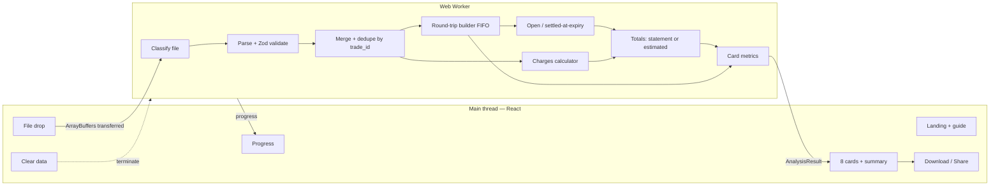

# Architecture

**Product:** F&O Wrapped  
**Version:** 1.0

---

## 1. Components

| Component | Responsibility |
|-----------|----------------|
| Main thread | Rendering, file picking, image export, sharing. **Never** reads file contents. |
| Worker | Owns all user data during analysis; posts back only `AnalysisResult` and progress. |
| `src/engine` | Pure functions from bytes to `AnalysisResult`; runs identically in the worker, in Vitest, and in the verification harness. |

---

## 2. Pipeline

1. **Classify** each file by its headers: F&O tradebook, P&L statement, or unrecognised (`UnrecognizedFileError`). Equity / currency / commodity tradebooks → `UnsupportedSegmentError`.
2. **Parse + validate** every row with Zod (`API_CONTRACT.md` §2). One bad row rejects its file.
3. **Merge + dedupe** across tradebook files by `exchange + trade_id` (PRD D-14). Identical duplicates are dropped and counted. Duplicates with different fields → `ConflictingDuplicateError`.
4. **Sort** by `(executedAt, tradeId)`.
5. **Build round trips** per instrument with FIFO (§4).
6. **Classify unclosed** positions as `OPEN` or `SETTLED_AT_EXPIRY` (§5).
7. **Charges:** from the P&L statement if present, else the calculator (§6), marked *estimated*.
8. **Totals** (`API_CONTRACT.md` §6).
9. **Cards** (§7).

Progress is reported after each stage and every 2,000 rows inside stages 2 and 5.

---

## 3. Merge & dedupe

- Key: `exchange + trade_id` (PRD D-14). Trade IDs are exchange-issued, and a single file mixes NSE and BSE.
- “Identical” means every mapped `Fill` field except `sourceFile` / `sourceRow` is equal.
- Why files overlap: Console caps each download at 365 days, so users often download overlapping ranges.
- Gaps between files are **not** an error, but the UI shows the covered date ranges so the user can spot a missing year.

---

## 4. Round-trip builder (FIFO)

### 4.1 Rules

Process fills per `instrument.key` in sorted order. Keep a signed position and a FIFO queue of **open lots** `{ qty, pricePaise, openedAt }`.

1. **Opening fill** (position is flat, or the fill is in the same direction as the position): push a lot. If the position was flat, a new round trip starts at this fill’s `executedAt`.
2. **Closing fill** (opposite direction): consume lots from the **front** of the queue.
   - For each consumed chunk of `q` units: realised P&L = `q × (exitPrice − entryPrice)` for LONG, `q × (entryPrice − exitPrice)` for SHORT; holding = `executedAt − lot.openedAt`.
   - Partially consumed lots keep their original `openedAt` and price.
3. **Flat → round trip closes** at the fill that brings the position to exactly 0.
4. **Flip:** if a closing fill is larger than the open position, split it. The part that makes the position flat closes the round trip, and the remainder opens a new round trip in the opposite direction at the same timestamp and price.
5. **Partial fills** of one order (same `order_id`, several `trade_id`s) are independent fills. Order grouping matters only for brokerage (§6).

### 4.2 Outputs per round trip

| Field | Definition |
|-------|------------|
| `side` | LONG if opened by BUY, SHORT if opened by SELL |
| `qty` | Total units opened (equals units closed) |
| `avgEntryPaise` / `avgExitPaise` | Qty-weighted means of opening / closing fills |
| `grossPnlPaise` | Σ chunk P&L (exact integer; equals Σ sell value − Σ buy value) |
| `holdingMs` | Qty-weighted mean of chunk holding times, rounded to the nearest ms |
| `entryAt` / `exitAt` | First opening fill / fill that made it flat |

### 4.3 Canonical worked example

Instrument `NFO:NIFTY25NOV24000CE` (monthly call, expiry 2025-11-25). All times IST on 2025-11-20.

| # | Time | trade_id | order_id | Side | Qty | Price (₹) | Position after |
|---|------|----------|----------|------|-----|-----------|----------------|
| 1 | 10:00:00 | T1 | O1 | BUY | 150 | 100.00 | +150 |
| 2 | 10:05:00 | T2 | O2 | BUY | 150 | 110.00 | +300 (scale-in) |
| 3 | 10:20:00 | T3 | O3 | SELL | 120 | 120.00 | +180 (scale-out, partial fill of O3) |
| 4 | 10:20:00 | T4 | O3 | SELL | 80 | 120.00 | +100 (rest of O3) |
| 5 | 10:30:00 | T5 | O4 | SELL | 250 | 90.00 | −150 (**flip**) |
| 6 | 10:40:00 | T6 | O5 | BUY | 150 | 80.00 | 0 |

FIFO trace:

| Fill | Consumes | Chunk P&L (₹) | Chunk holding |
|------|----------|---------------|---------------|
| T3 | 120 of lot T1 @100 | 120 × (120−100) = **2,400** | 20 min |
| T4 | 30 of lot T1 @100 | 30 × 20 = **600** | 20 min |
| T4 | 50 of lot T2 @110 | 50 × 10 = **500** | 15 min |
| T5 (first 100) | 100 of lot T2 @110 | 100 × (90−110) = **−2,000** | 25 min |
| T5 (remaining 150) | — opens SHORT lot 150 @90 at 10:30 | — | — |
| T6 | 150 of short lot @90 | 150 × (90−80) = **1,500** | 10 min |

Resulting round trips:

| id | Side | Entry | Exit | Qty | Avg entry | Avg exit | Gross P&L | Holding |
|----|------|-------|------|-----|-----------|----------|-----------|---------|
| 1 | LONG | 10:00:00 | 10:30:00 | 300 | ₹105.00 | ₹110.00 | **₹1,500.00** (150000 paise) | **20 m 50 s** (1,250,000 ms) |
| 2 | SHORT | 10:30:00 | 10:40:00 | 150 | ₹90.00 | ₹80.00 | **₹1,500.00** (150000 paise) | **10 m** (600,000 ms) |

Checks:
- Round trip 1: avg exit = (200 × 120 + 100 × 90) / 300 = 110. Sell value 33,000 − buy value 31,500 = **1,500** ✓ (= 2,400 + 600 + 500 − 2,000).
- Holding 1 = (150 × 20 + 50 × 15 + 100 × 25) / 300 = 6,250 / 300 = 20.833… min = 1,250 s ✓.
- Brokerage (options, ₹20 per executed order): 5 orders (O1–O5) → ₹100, even though there are 6 fills.

`test_worked_example_canonical` MUST reproduce this table exactly.

---

## 5. Unclosed positions

After all fills are processed, any non-empty lot queue is an unclosed position. `asOf` = the last `tradeDate` in the data.

| Condition | Status | P&L treatment |
|-----------|--------|---------------|
| `instrument.expiry <= asOf` | `SETTLED_AT_EXPIRY` | Valued from the P&L statement’s per-symbol row if available (`API_CONTRACT.md` §3), otherwise **excluded** |
| `instrument.expiry > asOf` | `OPEN` | **Excluded** |

Applies to options and futures, including physically settled stock F&O (PRD D-11). Card 1 and card 2 show *“{n} positions that expired or are still open aren’t included.”* whenever any position is excluded.

Why no intrinsic-value estimate: the tradebook has no settlement price. Estimating one would be an invented number.

---

## 6. Charges calculator

### 6.1 Computation

For each fill, look up the rate window containing `tradeDate`. Compute on the fill value `v = qty × pricePaise` (premium value for options):

| Charge | Options | Futures | Basis |
|--------|---------|---------|-------|
| Brokerage | flat per executed order | `min(cap, pct × order value)` per executed order | per `(orderId, tradeDate)` |
| STT | % of sell premium | % of sell value | sell fills |
| Exchange txn | % of premium | % of value | all fills, rate by exchange |
| SEBI fee | ₹ per crore of value | ₹ per crore of value | all fills |
| Stamp duty | % of buy premium | % of buy value | buy fills |
| GST | % of (brokerage + exchange txn + SEBI) | same | derived |

Rounding: aggregate each charge **per trading day** and round to the nearest paise (half up), then sum days. If the ±0.5% launch gate fails, the rounding level (per fill / per order / per contract note) is the first thing to check against real contract notes. Record the finding here.

### 6.2 Rate table (`src/engine/charges/rates.ts`, version 2026.09.1)

> **Checked against secondary sources only (2026-09-25).** zerodha.com, NSE and BSE pages can't be reached from the build environment, so each value was checked via search results and news coverage and is marked `checked: 'secondary'`. Before launch, re-check every row against the primary source and mark it `'primary'` (ACCEPTANCE_CRITERIA §A).

| Charge | Options | Futures | Window |
|--------|---------|---------|--------|
| Brokerage | ₹20 / executed order | min(₹20, 0.03%) / executed order | from 2024-10-01 |
| STT (sell) | 0.1% of premium | 0.02% of value | 2024-10-01 → 2026-03-31 |
| STT (sell) | **0.15%** of premium | **0.05%** of value | from 2026-04-01 (Union Budget 2026) |
| NSE txn | 0.03503% of premium | 0.00173% of value | from 2024-10-01 |
| BSE txn | 0.0325% (SENSEX, BANKEX, SENSEX50); 0.005% (stock options) | **not listed** | from 2024-10-01 |
| SEBI | ₹10 / crore | ₹10 / crore | from 2024-10-01 |
| Stamp duty (buy) | 0.003% | 0.002% | from 2024-10-01 |
| GST | 18% of brokerage + txn + SEBI | same | from 2024-10-01 |

Known gaps, which the app reports rather than papering over:
- **Trades before 2024-10-01** and **BSE futures** have no window. Cards 1–2 say charges can’t be estimated, and the other cards still render.
- **₹40 brokerage:** from 2026-04-01 Zerodha charges ₹40 per order when an account falls short of the 50% cash-collateral rule. A tradebook can’t show that, so the estimate uses ₹20. This is one reason every estimate is labelled *estimated*.
- **Exercised / assigned options** (STT on intrinsic value) and **IPFT / clearing charges** are not modelled (PRD D-12).

Dates for which no window exists → `ChargesUnavailableError`. The UI message is *“We can’t estimate charges for trades on {date} ({charge}). Add your P&L statement for exact numbers.”*

--------|---------|---------|----------------|
| Brokerage | ₹20 / executed order | min(₹20, 0.03%) / executed order | verify |
| STT | 0.1% of sell premium | 0.02% of sell value | 2024-10-01 |
| NSE txn | 0.03503% of premium | 0.00173% of value | 2024-10-01 |
| BSE txn | verify (differs by contract) | verify | 2024-10-01 |
| SEBI | ₹10 / crore | ₹10 / crore | verify |
| Stamp duty (buy) | 0.003% | 0.002% | verify |
| GST | 18% | 18% | verify |

Dates for which no window exists → `ChargesUnavailableError` in estimated mode. The UI message is *“We can’t estimate charges before {date}. Add your P&L statement for exact numbers.”*

---

## 7. Card metrics

Notation: `RT` = round trips included in per-trade cards (`exitKind` TRADE, plus EXPIRY when valued from the statement). A **win** has `gross > 0`, a **loss** has `gross < 0`, and a **scratch** has `gross == 0`. Scratches count toward trade totals but are neither wins nor losses. Per-trade cards use **gross** P&L, labelled *“before charges”* (PRD D-2).

**Median:** sort the values. For an odd count, take the middle value. For an even count, take the mean of the two middle values and round to the nearest integer, with half rounded up.

| # | Card | Formula | Minimum data (else `INSUFFICIENT_DATA`) |
|---|------|---------|------------------------------------------|
| 1 | The number | `totals.netPnlPaise`; `totalTrades = |RT|`; `tradedValue = Σ |qty × price|` over all fills | ≥ 1 round trip |
| 2 | Where the money went | `gross = totals.grossPnlPaise`, `charges = totals.charges.total`; `pct = charges / gross × 100` if `gross > 0`, else `null` and D-7 copy | ≥ 1 round trip |
| 3 | Right but broke | `winRate = wins / (wins + losses)`; `avgWin = mean(gross of wins)`; `avgLoss = mean(|gross| of losses)` | ≥ 10 RT, ≥ 1 win and ≥ 1 loss |
| 4 | Expiry day | Split RT by `exitDate == instrument.expiry`; sum gross and count each group | ≥ 1 RT in each group |
| 5 | Your clock | Bucket RT by **entry** time: `floor((minuteOfDayIst − 555) / 15)` clamped to 0..24; sum gross per bucket. Best / worst = max / min bucket P&L among buckets with ≥ 5 RT; ties → earlier bucket | ≥ 20 RT (best/worst may still be `null`) |
| 6 | Revenge trades | `m = median(|gross|)` over losses. Trigger = each loss with `|gross| > m`. Revenge RT = any RT (any instrument) with `entryAt ∈ (trigger.exitAt, trigger.exitAt + 15 min]`, each counted once. Output `count` and `Σ gross` | ≥ 5 losses (count 0 is a valid OK result) |
| 7 | Diamond / paper hands | `median(holdingMs)` of wins vs of losses | ≥ 3 wins and ≥ 3 losses |
| 8 | Best & worst day | Σ gross per `exitDate`; best = max, worst = min; ties → earliest date | ≥ 2 distinct exit dates |

**Summary share card** (PRD D-13): headlines are **Net P&L**, **Charges paid**, and **Win rate**. If card 3 is insufficient, show **Trades** instead of win rate. Also shows the Samvat year and the site URL. Never shows percentiles, symbols, or account identifiers.

### 7.1 Samvat year

`config/samvat.ts` maps each Samvat year to an inclusive IST date range starting on its Muhurat-trading day. Muhurat 2026 is on 8 Nov 2026 (announced); re-check each date against NSE circulars before launch.

| Samvat | From | To |
|--------|------|----|
| 2080 | 2023-11-12 | 2024-10-31 |
| 2081 | 2024-11-01 | 2025-10-20 |
| 2082 | 2025-10-21 | 2026-11-07 |
| 2083 | 2026-11-08 | open |

The label is the Samvat year of the RT exit dates. If they span more than one year, show the range (`2081–82`). If any date falls outside the table, `samvatLabel` returns `null`, and the cards and share image show the calendar date range instead.

---

## 8. UI architecture

- Screens: `Landing → Progress → Cards → (Error)`, controlled by a single reducer in `src/app`.
- Cards: horizontally paged, story-style. Tap right half = next, left half = previous; swipe; arrow keys. Progress bars at the top.
- Every card renders its `notes` (e.g. *estimated*, *before charges*, exclusions) in small text on the card itself. Notes are never hidden behind a tooltip.
- Share: render `SummaryCard` off-screen at 1080×1920, `toPng` → `Blob` → `File`, then `navigator.share({ files })` when `canShare`, else an `<a download>` click.
- Clear data: reducer reset, `worker.terminate()`, new worker, revoke object URLs.

---

## 9. Complexity

| Stage | Cost |
|-------|------|
| Parse | O(R) rows |
| Merge / dedupe | O(R) with a `Map<trade_id, Fill>` |
| Sort | O(R log R) |
| FIFO | O(R) amortised (each lot is pushed and fully consumed once) |
| Charges | O(R) |
| Revenge trades | O(T log T) with sorted entry times and binary search per trigger |

---

## 10. Explicit non-architecture

- No server, no API calls, no persistence
- No per-trade charge allocation (see PRD D-2)
- No settlement-price lookup for expired positions
- No percentile or peer comparison
